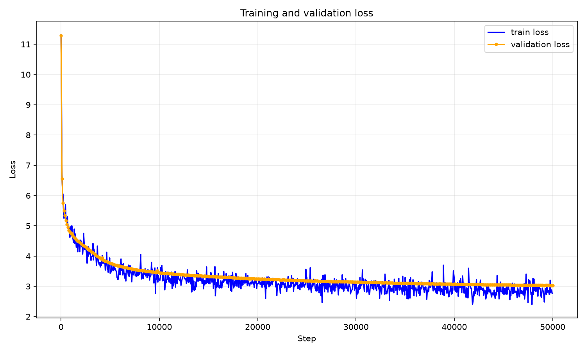

# Japanese Multiple-Choice Decision Model (Jev-inspired)

English | [日本語](README.ja.md)

This research project builds a Japanese model from pretraining in JAX/Flax that takes a context, question, and candidate options and returns a probability for each option. It is inspired by [TypeSafe AI's Jev](https://typesafe.ai/blog/introducing-system-one-models-and-jev), but **is neither an official implementation nor a reproduction of Jev**.

## Model and training overview

- A Japanese causal language model is pretrained, then its weights are adapted to multiple-choice decision tasks.
- The backbone uses [Grouped-Query Attention (GQA)](https://arxiv.org/abs/2305.13245), sparse MoE, and looped blocks with shared weights. Matrix weights are updated with [Muon](https://github.com/KellerJordan/Muon); other parameters use AdamW.
- For decision tasks, token representations are averaged within each option, then scored by their dot product with the final decision-token representation. There are no fixed classifier weights for individual options. The current configuration supports up to six options.
- The model uses structured input as is and scores only the provided options simultaneously. Since it does not freely generate text, it does not produce outputs outside the candidate set.

The architecture choice also reflects the author's personal taste.

Configuration files are in [`configs/`](configs/). The default dependencies specify a CUDA 13 build of JAX; check the JAX dependency in `pyproject.toml` for your environment.

## 1. Pretraining

Pretraining uses the `sample_10BT` configuration of [FineWeb2 Edu Japanese](https://huggingface.co/datasets/hotchpotch/fineweb-2-edu-japanese) and the tokenizer from [LLM-jp 13B v1.0](https://huggingface.co/llm-jp/llm-jp-13b-v1.0). Only the tokenizer is used; no pretrained model weights are loaded.

```bash
uv run pretrain.py
```

Results after 50,000 steps using [`configs/pretrain.yaml`](configs/pretrain.yaml):

| Metric | Value |
| --- | ---: |
| Train loss (step 49,950) | 2.7633 |
| Validation loss (step 49,999) | 3.0324 |
| Validation perplexity | 20.75 |

Pretraining train and validation loss trajectories:



Train loss includes MoE auxiliary losses, while validation loss is LM loss only.

## 2. Synthetic scenario generation and judging

A local LLM generates Japanese contexts, questions, and options. A separate judging pass produces target distributions over those options. The default model for both steps is `gemma4:26b`. Edit the YAML files to configure the available model name, endpoint, sample count, and concurrency.

```bash
uv run generate_synthetic.py
uv run judge_synthetic.py
```

- Generation: [`configs/synthetic.yaml`](configs/synthetic.yaml). The script reads any existing `raw.jsonl` and generates more scenarios until the total reaches `target_count`.
- Judging: [`configs/judge_synthetic.yaml`](configs/judge_synthetic.yaml). Already judged scenarios are skipped by ID.

## 3. Building the decision corpus

The corpus combines judged synthetic data with JNLI, JCommonsenseQA, and JSTS from [JGLUE](https://github.com/yahoojapan/JGLUE) for training and validation. The validation set from [JCoLA](https://github.com/osekilab/JCoLA) is used for transfer evaluation. See the [JGLUE paper](https://aclanthology.org/2022.lrec-1.317/) and [JCoLA paper](https://aclanthology.org/2024.lrec-main.828/) for dataset details.

```bash
uv run build_decision_corpus.py
```

The script clones required public repositories if they are not available locally, then creates training and evaluation JSONL files in `data/decision_corpus/`.

JGLUE and JCoLA are each released under **CC BY-SA 4.0**. Check their respective licenses before using or redistributing the source datasets.

## 4. Training the decision model

A generic option-scoring head is added to the pretrained backbone and trained on the decision corpus. Training data, evaluation sets, optimization settings, and output paths are specified in [`configs/decision.yaml`](configs/decision.yaml). Before running, verify that its `pretrained_checkpoint` exists.

```bash
uv run train_decision.py
```

Checkpoints are saved at each evaluation. The two most recent checkpoints and the `best` checkpoint, selected by the lowest validation NLL across all evaluation datasets, are retained.

## 5. Results and demos

### Evaluation results

The `best` checkpoint is selected by the lowest validation NLL across all evaluation datasets.

| Checkpoint | Step | Accuracy |
| --- | ---: | ---: |
| `best` | 3,042 | 70.50% |

| Dataset | Examples | Accuracy |
| --- | ---: | ---: |
| JNLI | 2,434 | 81.47% |
| JCommonsenseQA | 1,119 | 69.44% |
| JSTS | 1,457 | 51.89% |
| Synthetic decisions | 792 | 56.82% |
| JCoLA | 1,550 | 78.52% |

With `stream_decision_eval.py`, model inference after initial compilation measured approximately `10 ms/example`, or 100 examples/second. Tokenization, initial compilation, and display are excluded from this measurement.

### Interactive demo

Enter a context, question, and options to see predicted probabilities for each option.

```bash
uv run interactive_decision.py
```

To use a different saved model, pass `--checkpoint <checkpoint-path>`.

Example output:

```text
STATE
(Finish with an empty line)
> 天気予報によると雨が降ってくるようだ
>

QUESTION> 持っていくべきものはなんですか

OPTIONS
Enter one option per line.
Empty line finishes options.
1> 折りたたみ傘
2> パソコン
3> スマホ
4>

================
 > 1.  83.67% 折りたたみ傘
   2.   2.66% パソコン
   3.  13.67% スマホ
model latency: 10.14 ms
```

### Evaluation examples and inference speed

By default, the script displays 20 JCommonsenseQA validation examples. It prints each input, predicted probabilities, gold answer, and inference time, then reports accuracy and average speed.

```bash
uv run stream_decision_eval.py
```

Use `--limit 0` to display all examples. For synthetic data, use `--data data/decision_corpus/eval_synthetic.jsonl --source synthetic_decisions`. The speed measurement covers only fixed-length, single-example inference; it excludes initial compilation, input preparation, and display.

## References

- [TypeSafe AI: Introducing System One Models & Jev](https://typesafe.ai/blog/introducing-system-one-models-and-jev)
- [FineWeb2 Edu Japanese](https://huggingface.co/datasets/hotchpotch/fineweb-2-edu-japanese)
- [LLM-jp 13B v1.0](https://huggingface.co/llm-jp/llm-jp-13b-v1.0)
- [JGLUE](https://aclanthology.org/2022.lrec-1.317/) / [JCoLA](https://aclanthology.org/2024.lrec-main.828/)
- [GQA](https://arxiv.org/abs/2305.13245) / [Muon](https://github.com/KellerJordan/Muon)
- [Sparse Layers are Critical to Scaling Looped Language Models](https://arxiv.org/abs/2605.09165)
